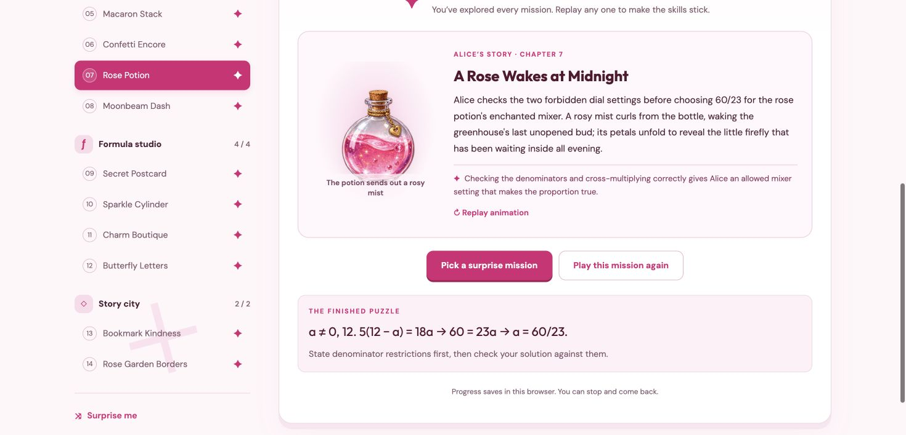

# Kids Learning Games

## Alice’s Algebra Arcade

A pink algebra adventure with 14 missions per set. Guided steps practice
equations, fractions, formulas, special cases, and word problems. Set 2 adds
illustrated story endings and themed animations after every completed mission.
Alice can replay an animation, restart an exercise at any step, and resume
saved progress in the same browser.

**Play:** download the repository and open
[`Alice-Algebra-Arcade.html`](Alice-Algebra-Arcade.html) in Chrome. No install or
server needed. The original question set is in
[`Alice-Algebra-Arcade-Set-1.html`](Alice-Algebra-Arcade-Set-1.html).

**Edit the game:** see [`pink-algebra/README.md`](pink-algebra/README.md) for the
source files, local server instructions, and verification details. The current
standalone game includes its scripts, styles, and illustrations.

## Grammar Detective

An interactive grammar game for 6th graders. Twenty case files (units) of ten
clues (questions) each, covering nouns through quotation marks and a final mixed
review. Every answer comes with a short explanation of the rule, and stars and
detective ranks are saved in the browser.

**Play:** open `index.html` in Chrome. No install or server needed.

**Edit questions:** each question is one line in the `UNITS` list near the top
of the script in `index.html`. Fields: `q` question, `s` sentence shown as
evidence (`___` marks a blank), `o` four options, `a` index of the correct
option, `w` explanation.
